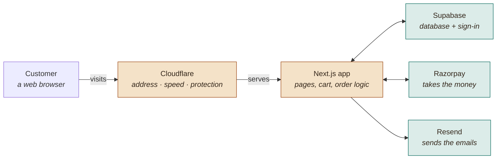
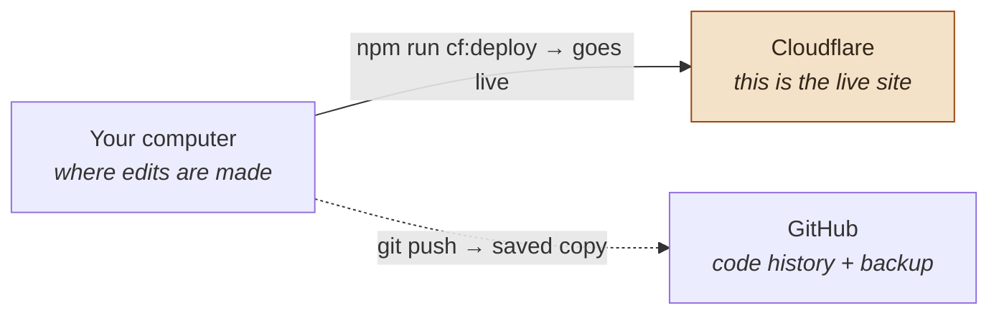

# How the Gītā store is put together

A plain-language map of the pieces behind **[gita.vrnda.store](https://gita.vrnda.store)** —
what each one does, and how a page and a payment travel between them.

> For the deeper technical version see [ARCHITECTURE.md](./ARCHITECTURE.md).
> For deployment steps see [DEPLOY.md](./DEPLOY.md).

---

## When someone visits the shop

A reader's browser only ever talks to Cloudflare. Everything behind it is reached
by the site itself, never by the visitor directly.

You reach the admin dashboard by the same path — it is just a page that only your
account can open.

---

## When the site is changed

Worth knowing, because it surprises people: pushing to GitHub and deploying to
Cloudflare are **two separate acts**. Pushing alone changes nothing a customer sees.

GitHub never serves the site to anyone.

---

## What each piece does

| Piece | Role | What it does |
|---|---|---|
| **Cloudflare** | Hosting & front door | Answers the web address, serves pages quickly worldwide, and turns away abusive traffic before it reaches anything else. The site runs here. |
| **Next.js** | The website itself | Every page a reader sees, plus the private code that prices a cart, records an order, and drives the admin dashboard. |
| **Supabase** | Database & sign-in | The permanent memory: orders, course signups, and readers' own bookmarks and notes. Also handles logging in. |
| **Razorpay** | Payments | Collects money by UPI, card or netbanking, and tells the site the moment a payment truly succeeds. Card details never touch your site. |
| **Resend** | Email | Sends order confirmations, shipping notices with tracking, refund notices, and the alert that tells you a sale came in. |
| **GitHub** | Code backup | A second copy of every file and every change ever made, so nothing is lost and any change can be traced or undone. |
| **GoDaddy** | Domain registrar | Where `vrnda.store` is registered. Its only job here is pointing the name at Cloudflare. |

---

## A single purchase, end to end

The clearest way to see how the parts hand off to each other.

1. **Cloudflare** serves the book page; the price shown is read live from Supabase.
2. At checkout, **the site** ignores whatever the browser claims a price is and
   recalculates the total itself.
3. **Razorpay** collects the payment, then signs a message proving it was genuine.
4. **The site** checks that signature, records the order in **Supabase**, and gives
   it a number.
5. **Resend** emails the customer a confirmation and alerts you that a sale came in.

---

## One thing that often needs explaining

`vrnda.store` and `gita.vrnda.store` are **two different sites**. The root address
still goes to your Shopify clothing store; only the `gita.` subdomain points at this
one. They share a domain name and nothing else, so either can change without
disturbing the other.

---

## Where the branches live

| Branch | Holds | Serves |
|---|---|---|
| `nextjs` | The whole application — this is the real codebase | Deployed to Cloudflare |
| `main` | Redirect stubs only | GitHub Pages, which forwards old links to `gita.vrnda.store` |
